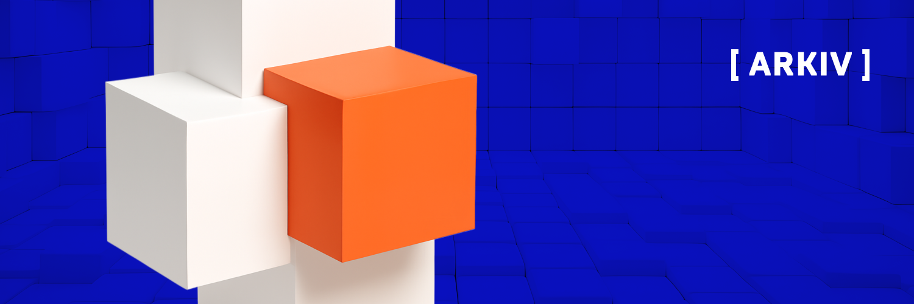

# Arkiv Web3 Database Builders Challenge

After an iconic Hackathon at Devconnect Buenos Aires 2025, we're teaming up again with [Ethereum Argentina](https://ethereumargentina.org/) \- this time to offer two lucky winners a $2k stipend (each) and tickets to [EthCC](https://ethcc.io/) in Cannes Mar 30-Apr 02\. We saw the talent in Argentina, now it's time to share the best LATAM has to offer with Cannes\!

Every Web3 team runs on centralized tools. Your events on Luma, your docs on GitBook, your job postings on LinkedIn. You're building decentralized systems on infrastructure you don't own.

We think that's worth fixing. We know there's some devs in Argentina that probably have a way to fix it. Now's the chance.

**The Arkiv Web3 Database Builders Challenge** is an invitation to build a Web3-native tool where the data is owned by users, not platforms. Pick one of three verticals; each one replaces a tool you already use with something you actually control.

This isn't a hackathon sprint where you glue an API together in 48 hours and never touch it again. You get **two full weeks** to build something that actually works. Something you'd put in your portfolio. Something that could become a reference implementation other developers learn from.

---

## Pick Your Vertical

| Vertical | Build | You're replacing |
| :---- | :---- | :---- |
| **Job Board** | A job platform where postings, profiles, and applications are owned by users | LinkedIn, Indeed |
| **Event Platform** | A Luma-style tool where events, RSVPs, and attendance live on-chain | Luma, Eventbrite |
| **Knowledge Base** | A documentation platform where your docs belong to you, not the hosting provider | GitBook, Notion |

All three are scored on the same rubric. There's no advantage to picking one over another — go with whatever excites you.

---

## What's in it for you

**The obvious:**

- Two winners, **$2,500 USD each** (paid in USDC). That's $2.5k towards flights and a ticket for EthCC [9], March 30 – April 2\. All logistics, visa applications (if needed) will be on your shoulders, we support with the funds\!
- If you're a larger team (e.g. more than 2 people) or a smaller team \- that's fine, but the max prize delivered will be $2500 for each of the two winning submissions. How you split the funds is up to you!

**The less obvious:**

- Ship a working product on a data layer most devs haven't touched yet.
- Code should be open source. The best submissions become a reference for other builders when they want to understand what's possible with Arkiv.
- Support from the Arkiv team throughout the build window. Our actual team in [Discord](https://discord.gg/arkiv) [**\#builders-challenge**](https://discord.com/channels/1422146278883852412/1473629252183392266) helping you when you get stuck.

**The honest part:**

- Arkiv is early. You're not building on a platform with 10,000 tutorials and a Stack Overflow tag. You're building on something new, with docs that might be a little bit rough and a working SDK, but you'll be one of the first. That's either exciting or terrifying depending on who you are. **We're looking for the ones who find it exciting**. If you built with us at Ethereum Argentina's Hackathon in November, you'll already know how we work \- welcome back\!

---

## Who this is for

- Developers who can build a full-stack web application
- This challenge is run in collaboration with Ethereum Argentina, but anyone from any location is welcome to take part.
- Solo or team, the prize fund remains the same.
- Any stack on the frontend — Arkiv is the web3 database, you pick everything else
- You don't need to know Arkiv beforehand. The starter kit and docs will get you there.

---

## Timeline

| Date | What |
| :---- | :---- |
| **Feb 23** | Submissions open / challenge kickstart |
| **Mar 6** | Submissions close (23:59 UTC) |
| **Mar 9–10** | Judging |
| **Mar 10–11** | Winners announced |

*The Organizer reserves the right to adjust these dates. Any changes will be communicated via Discord and official channels. See [RULES.md](RULES.md) for full terms.*

---

## Quick Links

### Understand the Challenge

| What | Where |
| :---- | :---- |
| **Builder's Guide** | [docs/builders-guide.md](docs/builders-guide.md) — verticals, requirements, getting started |
| **Official Rules** | [RULES.md](RULES.md) — terms, prizes, eligibility |
| **Scoring Rubric** | [docs/scoring-rubric.md](docs/scoring-rubric.md) — how we score, what we look for |
| **FAQ** | [FAQ.md](FAQ.md) — common questions answered |

### Start Building

| What | Where |
| :---- | :---- |
| **Arkiv Docs** | [arkiv.network/docs](https://arkiv.network/docs) |
| **TypeScript SDK** | [Getting started](https://arkiv.network/getting-started/typescript) |
| **Python SDK** | [Getting started](https://arkiv.network/getting-started/python) |
| **Developer Portal** | [arkiv.network/dev](https://arkiv.network/dev) |

### Submit & Get Help

| What | Where |
| :---- | :---- |
| **Submit** | [Submission form](https://forms.arkiv.network/web3-db-challenge) |
| **Discord** | [Join our server](https://discord.gg/arkiv) → [#builders-challenge](https://discord.com/channels/1422146278883852412/1473629252183392266) |

---

*This is not a contest for the biggest team or the prettiest mockup. It's a builders challenge. Ship something real on a new data primitive. The best work speaks for itself.*
